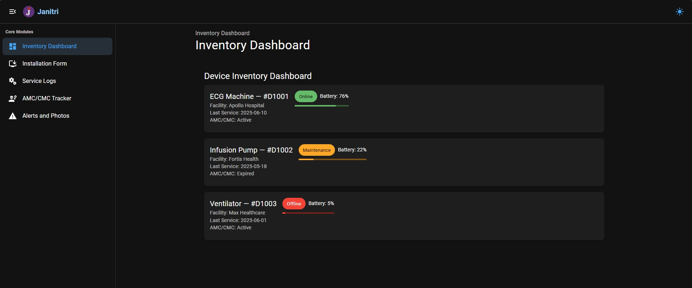
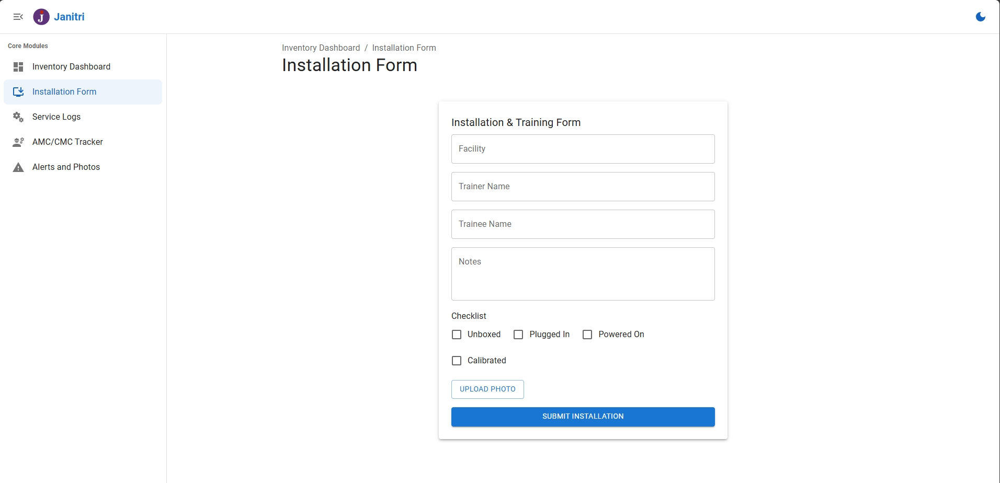
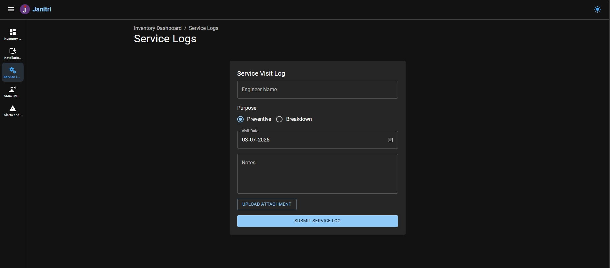

# Janitri Device CRM + Inventory Dashboard

A full-featured internal dashboard to manage medical device installations, inventory, service logs, contracts (AMC/CMC), and alert logs.  
Built with **ReactJS**, **Redux Toolkit**, and **Material UI**, and powered by **MUI Toolpad's layout system**.

> 🧑‍⚕️ Developed for the Janitri Front-End Internship Assignment  
> 🔗 **Live Demo:** [janitri-dashboard.vercel.app](https://janitri-dashboard.vercel.app)

---

## 📸 Screenshots







---

## 🚀 Features

### ✅ Core Modules

| Module                      | Description                                                                          |
| --------------------------- | ------------------------------------------------------------------------------------ |
| **Inventory Dashboard**     | View all devices, their status, battery level, last service date, and AMC/CMC status |
| **Installation & Training** | Checklist flow + photo upload + trainer/trainee details                              |
| **Service Visit Logs**      | Log preventive/breakdown visits, with engineer, notes, attachment                    |
| **AMC/CMC Tracker**         | Add contracts, auto-expiry detection, CSV export, vendor tracking                    |
| **Alerts & Photo Logs**     | Log real-time alerts with issue type, engineer, photo evidence                       |

---

## ⚙️ Tech Stack

- **ReactJS + TypeScript**
- **Vite** for fast dev builds
- **Redux Toolkit** for global state
- **React Router v7** (data router)
- **Material UI v7** (MUI)
- **MUI Toolpad** (beta) layout system
- **react-csv** for report exporting
- **Mock data from `public/data/*.json`**

---

## 🧱 Folder Structure (Simplified)

```txt
janitri-dashboard/
├── public/
│   └── data/              # Demo JSON files (devices, alerts, amc)
└── src/
    ├── components/        # Reusable UI components (e.g. DeviceCard)
    ├── layouts/           # Toolpad layout wrapper
    ├── modules/           # Core modules (Inventory, AMC, Installations, etc.)
    ├── redux/             # Redux store and slices
    ├── theme/             # MUI custom theme
    └── main.tsx           # Entry point
```

---

## 📦 Getting Started

### 🛠 Local Setup

```bash
git clone https://github.com/mayurdange15/janitri-dashboard.git
cd janitri-dashboard
npm install
npm run dev
```

### 🔍 View App

**Visit:** http://localhost:5173

## 📤 Export Features

- AMC/CMC Contracts → CSV using react-csv
- Future export support can be extended to service logs and alerts

## 💡 Optional Features (Planned)

- LocalStorage or indexedDB data persistence
- Search / filter by device, facility, contract status
- QR code scanner to auto-fill device IDs
- Role-based access control
- Form validation via Yup (currently basic)

## 👨‍💻 Author

Mayur Dange
🔗 [janitri-dashboard.vercel.app](https://janitri-dashboard.vercel.app)
🧠 Built for the Janitri Internship Assignment

## 📄 License

MIT — use, adapt, and improve.
